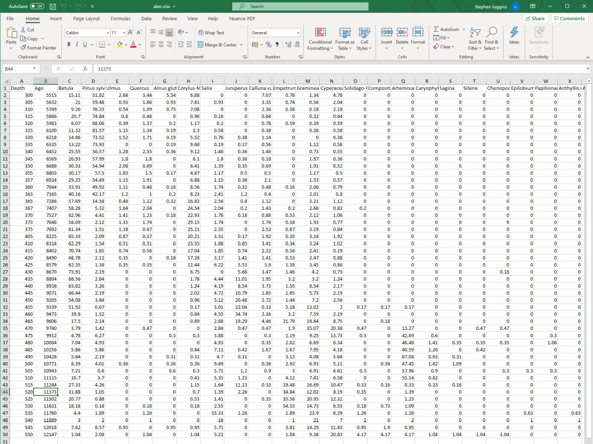

---
output:
  pdf_document: default
  html_document: default
---
# riojaPlot Version 1.0

# Steve Juggins Oct 2020

## Introduction

riojaPlot is a web app for plotting stratigraphic data found in micropalaeontological or palaeoecological studies. It can plot multiple biological and non-biological proxies against depth or age and allows trends to be visualized using a range of plot types.  

## Input data

Data should be in an Excel spreadsheet, with a single row of column names.  These names will be used to label the x-variables so choose them carefully.  Any variables charting with the words "Depth" or "Age" will be used as y-variables.  For example, "Depth_in_m"" or "AgeBP" are fine, "Years BP" or "core depth" are not.  This allows one to plot the data using different age models by labelling the columns "Age01", "Age02" etc.  If you do not include a Depth or Age variable samples data be plotted against sample number.  All other columns are used as x-variables.  Data are plotted 'as is' and in the order they appear in the file.  That is, if you want to plot a diagram of microfossil counts expressed as relative abundances you should supply percentage data with columns in correct the order.  An example spreadsheet containing pollen stratigraphic data from Birks & Mathews (1978) can be downloaded from the Help tab.  A screenshot of the data is listed at the end of this help file.

## Getting started

Upload a Excel file and select the worksheet to use, or check the box **Use example dataset**.  If your data look like biostratigraphic data with row sums in the range 50-150 riojaPlot will assume they are percentages and scale each curve appropriately, and de-select any variables with a maximum value less than 2. If not, each curve will have equal width and be scaled from min-max data values (option **Scale for %** under the **Settings tab**), and all variables will be plotted.  

## Options

### Variables

Select a variable for the **Y axis** (if you have included more than one Depth or Age variable).  **Select X variables**: If the data look like biological counts transformed to percentages then variables with a maximum value of less than 2.0 wll be de-selected to avoid over-crowding.  Use this option to remove or add variables to the diagram.  

### Settings

- **Style**: Choose to plot each variable with lines, symbols or silhouettes (filled curves).  Some combinations do not make sense or look ugly so choose wisely.

- **Show bar**: Show horizontal bars, either alone or superimposed on a line, symbol or silhouette plot.  **Curve** extends the bar to the data value, **Full** extends the bar the full width of the plotting area.  Try it with silhouettes, and **Bars on top** unchecked.

- **Bars on top**: plot bars on top of silhouette or below. 

- **Settings**: **Show 5x exag**: adds a light grey curve with 5 x exaggeration to  the plot, to highlight varition in low-value parts of the curve.  **Scale for %** scales each curve from zero to maximum value and adjusts width to keep scaling constant between curves.  **Show min/max**: with **Scale for %** unchecked, shows either min / max or multiple values on x-axes (to prevent label crowding).  **Auto sort vars**:  sorts variables to highlight sequence from those with high values at base on left, to those with high values at top on right (can be useful to visualize trends in biostratigraphic data).

### Colours

Select colour for lines, bars, silhouettes, symbols and zones.

### Sizes

Adjust axis and lable font size and label rotation.

### Zonation

Add a zonation (constrained clustering) to the diagram using CONISS (Grimm 1987).  Optional show zones on the diagram with the number of zones determined automatically using a broken-stick model (Bennett 1996) or chosen manually.

### Groups

Assign each variable to a group and plot silhouettes in a different colour for each group.

## Save the plot

Save the plot as a pdf, png or svg file.  Scalable vector graphics (svg) format is good for importing into Powerpoint or Word.

## Details

**riojaPlot** is powered by the function `strat.plot` in the R package [rioja](https://cran.r-project.org/web/packages/rioja/index.html).  The web interface is built using [shiny](https://shiny.rstudio.com/) and [shinydashboard](https://rstudio.github.io/shinydashboard/index.html).  

## Example dataset

Pollen stratigraphic data from the Abernethy Forest, Scotland, spanning approximately 5500 - 12100 BP (from Birks & Mathews 1978).

## Contact

Bug reports and suggestions for improvement to Steve Juggins: Stephen.Juggins@ncl.ac.uk.

## References

Bennett, K (1996) Determination of the number of zones in a biostratigraphic sequence. *New Phytologist*, **132**, 155-170.

Birks, HH & Mathews, RW (1978) Studies in the vegetational history of Scotland V. Late Devensian and early Flandrian macrofossil stratigraphy at Abernethy Forest, Invernessshire. *New Phytologist*, **80**, 455-84.

Grimm, EC (1987) CONISS: A FORTRAN 77 program for stratigraphically constrained cluster analysis by the method of incremental sum of squares. *Computers & Geosciences*, **13**, 13-35.